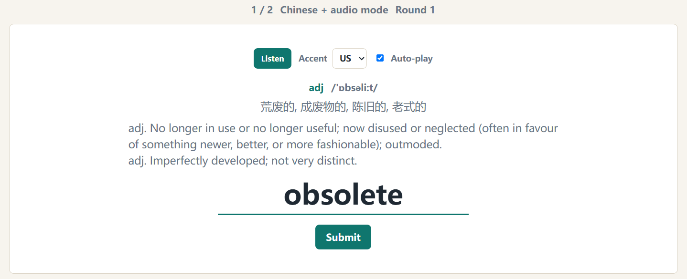
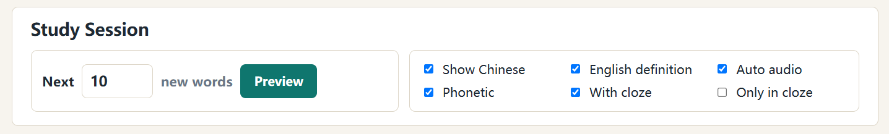
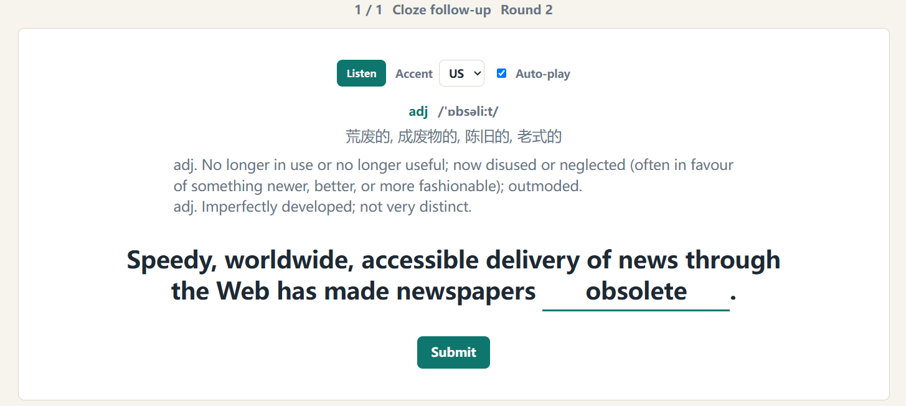
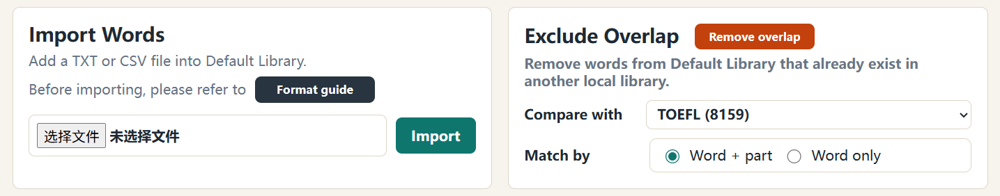
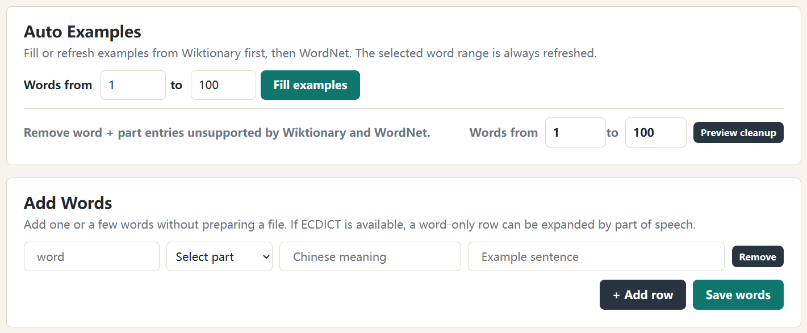
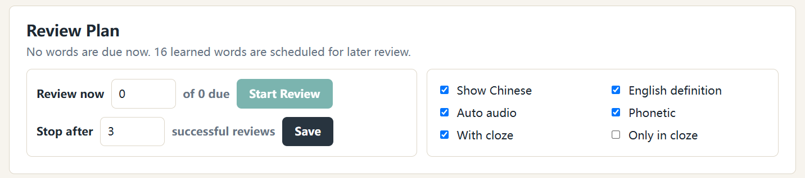

# typeng

Non-Chinese users can refer to [an English version of README](README.md).

typeng 是一款本地优先的英语单词打字记忆工具，使用 Python、Flask、SQLite 和本地网页界面构建。

它面向希望通过主动输入和语境理解来记忆单词的英语学习者。typeng 通过让用户键盘输入单词来肌肉记住单词的拼写，并提供尽可能完整的例子让用户补全来熟悉词汇的语境和用法，根据用户个性化的选择来给用户提供复习方案。

## 一些设计展示



typeng 的常规练习会同时呈现中文意思、词性、音标、英美发音和英文释义。词库中的同一个单词会按词性拆成更细的词条，帮助用户分别学习不同词性的意思和用法；对应词性的英文释义则面向更高阶的学习需求，让用户不只停留在中文含义上，而是进一步理解单词所在的语境。

如果用户拼写错误，typeng 会立即显示正确拼写，并在本组新词结束后让用户重新练习之前写错的单词，直到这一组词全部被正确拼写一次。之后用户可以自行决定哪些错词进入错词本，供日后复习。



typeng 尽量把学习节奏交给用户：可以选择接下来学习的词条数量，也可以自由组合中文、英文释义、音标、自动发音和 cloze 等模式。

其中 cloze 是 typeng 最重要的差异点。很多工具只让用户快速扫视例句，学习仍然停留在“认得单词”的阶段；typeng 会把例句中的目标词或词形变体挖空，让用户在语境中重新拼写。With cloze 会在常规拼写后追加一轮语境练习，Only in cloze 则以语境练习为主，没有例句的词条会自动退回常规拼写。



在 cloze 练习中，用户不是对着孤立释义回忆单词，而是在真实句子里补全目标词或它的变体。这样可以同时训练拼写、搭配和词形变化，也更接近真正使用单词时的状态。



为了让用户可以建立自己的词库，typeng 支持按 `Format Guide` 导入 TXT 或 CSV 文件，也支持在本地已有词库之间排除重复词。比如用户已经学过四六级基础词，就可以从 TOEFL 等更高阶词库中删去重合部分，减少不必要的重复学习。对于需要整理大量词条的情况，编辑界面也提供批量删除操作。



考虑到很多用户只想先给出要学习的单词，typeng 提供了自动填充功能。用户可以在选定范围内让系统根据词性匹配例句，Fill examples 会优先选择评分最高的例句；如果用户对当前例句不满意，也可以用 Refresh examples 在同一范围内从前 8 个合适候选中重新随机选择。对于暂时没有可靠例句的词条，用户可以通过 Preview cleanup 预览，再决定是否保留。

手动添加单词时，如果用户没有输入中文释义，typeng 会尝试从本地词典中按词性补全；如果只输入了单词，系统也可以根据词典中的词性拆分出多个词条。



每个词库都有独立的学习、错词和间隔复习状态。typeng 会根据用户学习每个词汇的时间，参考艾宾浩斯记忆曲线给出复习建议；用户也可以按自己的时间调整本次复习数量，以及一个词需要成功复习多少轮后停止提醒。

## 为什么做 typeng

做这个开源项目的出发点是我个人一直没有找到一款真正能让我高效记忆单词的软件。市面上很多主流背单词工具更偏向“认出单词”或者“选择含义”。这类练习可以帮助用户熟悉词义，但有时并不能保证用户真的能拼出单词，也不一定能把单词放回语境里使用。

我从小学开始就一直接触着一款叫 Dr.eye 的软件，通过键盘打字记忆单词，但它只能让用户自己提供单词和中文释义，并且没有语境。后来我也遇到有语境拼写的软件，但由于在手机上拼写，并没有很好的效果，且只有很小量的词库，所以我想让这个应用只面向电脑端用户，我希望通过键盘上打字形成的肌肉记忆让用户更深刻地记忆单词，理解单词。

typeng 更强调让用户真正把答案打出来，并且知道这个词为什么能放在这个句子里。它把单词学习拆成几个更具体的动作：看到中文或释义后回忆拼写，听到发音后输入单词，在例句挖空中理解词汇用法，并在错词和已学词复习中反复巩固。

相比只提供固定词库的工具，typeng 更希望成为用户自己的单词训练台：你可以直接使用预设考试词库，也可以导入课堂、生词本、阅读材料中整理出的单词；你可以手动写自己真正想记住的例句，也可以让系统先自动补全一个可参考的语境，再继续编辑。

这个项目目前坚持本地优先：

- 不需要账号系统
- 不做云同步
- 使用本地 SQLite 数据库
- 在用户自己的电脑上运行
- 可以选择使用本地词典资源来生成预设词库、英文释义和例句

## 功能细节

### 语境学习和 cloze 训练

- 支持基于例句的 cloze 挖空训练。
- 用户可以为单词手动添加自己的例句。
- 如果用户没有例句，typeng 可以从本地 Wiktionary / WordNet 资源中自动匹配例句。
- `With cloze` 模式：先普通拼写，再对有例句的单词进行 cloze 训练。
- `Only in cloze` 模式：有例句就做 cloze，没有例句就退化为普通拼写。
- cloze 练习接受词条原形和句子中的实际形式，并会提示句中正确形式。

### 词库定制

- 支持多个本地词库。
- 支持 TXT 和 CSV 词表导入。
- 支持手动添加单词和编辑词库。
- 支持用户自定义中文释义、词性和例句。
- 基于 ECDICT 标签生成预设词库，例如 CET4、CET6、IELTS、TOEFL、GRE、高考、中考、考研。
- 支持词库间排除重复词，方便用户从更高阶词库中去掉已掌握的基础词。

### 词性和释义

- 同一个英文单词可以按不同词性拆成多个词条。
- 不同词性会保留不同的中文释义、英文释义和例句。
- 适合训练熟词偏义，例如一个常见单词在名词、动词、形容词或副词中可能有完全不同的用法。
- 可选显示英文释义，英文释义会尽量按对应词性补全。
- 可选显示音标，避免纯听力训练时受到音标干扰。

### 练习和复习

- 按顺序进行学习，而不是随机打乱。
- 支持中文提示、纯音频、中文加音频等模式。
- 通过有道词典音频接口播放单词发音，支持 US/UK 选择，并在音频不可用时尝试使用浏览器语音合成兜底。
- 错词本支持每日复习，答对到用户设置的次数后移回已学区。
- 已学单词支持参考艾宾浩斯记忆曲线的间隔复习，每个词库可以独立设置复习目标次数。
- 每次复习前可以选择本次要复习的单词数量。
- 浏览器会记住练习选项，减少重复设置。

## 词典和例句来源

typeng 只使用用户自己的词表也可以运行，但如果提供本地词典资源，会更完整。

### ECDICT

ECDICT 主要用于：

- 生成考试或分类预设词库
- 中文释义
- 音标
- 词频
- `cet4`、`cet6`、`toefl`、`ielts`、`gre`、`gk`、`zk` 等标签

打包或本地使用时，将 CSV 放在：

```text
resources/ecdict.csv
```

来源：<https://github.com/skywind3000/ECDICT>  
许可：ECDICT 项目声明为 MIT License。

### Wiktionary / Kaikki

Kaikki 的英文 Wiktionary JSONL 导出目前作为主要来源，用于：

- 按词性匹配英文释义
- 按词性匹配英文例句
- cloze 例句

文件可以放在项目根目录，或者：

```text
resources/wiktionary/kaikki.org-dictionary-English.jsonl
```

typeng 会尽量过滤古义、废弃义、过时义、罕见义、词形变化项，以及不适合学习的例句。

### Open English WordNet

Open English WordNet 作为英文释义和例句的兜底来源。

将 zip 文件放在：

```text
resources/wordnet/english-wordnet-2025-json.zip
```

来源：<https://github.com/globalwordnet/english-wordnet>  
许可：Open English WordNet 项目声明为 CC-BY 4.0。

### 有道词典音频接口

typeng 当前通过有道词典的 `dictvoice` 音频接口提供英音和美音发音，并在接口不可用时尝试使用浏览器自带的语音合成作为兜底。开启发音功能时，浏览器会向有道的音频地址请求当前练习单词；如果完全离线，自动发音可能不可用。

## 隐私说明

typeng 坚持本地优先：你的词库、学习进度和 SQLite 数据库都不会离开你的电脑，
没有账号系统、埋点统计或云同步。

唯一的例外是可选的发音功能。开启音频播放时，浏览器会向有道词典公开的 `dictvoice`
音频接口请求当前练习单词，因此这一个单词会被发送到有道的服务器。如果你希望完全离线，
可以在练习选项中关闭自动发音，此时 typeng 会退回到浏览器自带的语音合成，不产生网络请求。

## 本地运行

当前版本主要面向开发和测试，运行方式如下：

```bash
python3 -m venv .venv
source .venv/bin/activate
pip install -r requirements.txt
python app.py
```

然后打开：

```text
http://127.0.0.1:5000
```

这是一个本地 Flask 网页应用。打开 `127.0.0.1` 不需要 VPN，也不需要互联网连接。

如果想测试接近桌面版的启动方式，也可以运行：

```bash
python run_typeng.py
```

## 下载与运行

typeng 为每个平台提供独立、开箱即用的本地压缩包。你不需要安装 Python、进入 WSL、
创建虚拟环境，也不需要输入任何 Flask 命令。下载、解压、运行即可——程序会自动启动本地
服务并在浏览器中打开。所有数据（SQLite 数据库、词库资源、学习记录）都保存在你自己的
电脑上。

在发行页获取最新的安装包：

**<https://github.com/Williamoel/typeng/releases/latest>**

### Windows

1. 下载 `typeng-<版本>-windows-x64.zip`。
2. 解压整个文件夹。
3. 双击 `typeng.exe`。
4. 首次运行时，Windows SmartScreen 可能会提示这是无法识别的应用（typeng 目前还没有
   代码签名）。点击 **更多信息 → 仍要运行** 即可。

### macOS

1. 下载 `typeng-<版本>-macos-arm64.zip`（Apple Silicon：M1/M2/M3）或
   `typeng-<版本>-macos-x64.zip`（Intel）。
2. 解压文件夹，然后运行其中的 `typeng`。
3. 由于应用未签名，macOS Gatekeeper 首次启动时可能会拦截。右键点击 `typeng` 选择
   **打开**，或在终端里执行一次：

   ```bash
   xattr -dr com.apple.quarantine <解压后的文件夹>
   ```

### Linux

1. 下载 `typeng-<版本>-linux-x64.zip`。
2. 解压文件夹，然后运行其中的 `./typeng`。

### 可选词典资源

发行包内含空的 `resources/` 目录，但不包含体积较大的词典文件（ECDICT、Wiktionary、
WordNet）——它们较大且各自带有许可证。若要启用预设考试词库、英文释义和例句，请按
[resources/README.md](resources/README.md) 和 [SOURCES.md](SOURCES.md) 的说明，
把这些文件放进解压后的 `resources/` 目录。

想自己构建安装包的维护者可以参考 [PACKAGING.md](PACKAGING.md)。

## 导入格式

typeng 支持 TXT 和 CSV 导入。

在编辑界面的 `Add Words` 中，用户也可以只输入单词，或输入单词加词性。只要本地有 ECDICT 资源，typeng 会尝试自动补全对应词性的中文释义；如果只输入单词，typeng 会按 ECDICT 中的词性拆成多个词条。`Add Words` 不会覆盖已有的相同单词加相同词性词条，如需修改已有词条，请在词库编辑列表中直接编辑。文件导入仍建议使用下面的标准格式。

必需字段：

- `word`
- `part_of_speech`
- `meaning`

可选字段：

- `example_sentence`

TXT 文件可以使用制表符、逗号或竖线分隔：

```text
abandon	verb	放弃；遗弃
ability	noun	能力
close	adjective	近的；亲密的
close	verb	关闭
abandon	verb	放弃；遗弃	The company decided to abandon the old plan.
```

CSV 文件可以使用表头：

```csv
word,part_of_speech,meaning,example_sentence
abandon,verb,放弃；遗弃,The company decided to abandon the old plan.
```

也可以不写表头，直接使用相同列顺序。

同一个英文单词可以因为词性不同而出现多次。同一个单词加同一个词性会被视为同一个词条。

## 练习规则

- 按 Enter 或按钮提交答案。
- 忽略首尾空格。
- 大小写严格。
- 普通单词练习要求输入词条中保存的标准单词。
- cloze 练习同时接受词条原形和句子中的实际形式。如果用户输入原形但句子中使用了变化形式，typeng 会判定正确，并在进入下一题前提示句中正确形式。
- 错误答案会用红色显示正确答案。
- 普通学习中，打错过的词会重复出现，直到本组所有词都被正确打出一次。最后用户可以选择哪些打错过的词进入错词本。

## 复习机制

每个词库有独立的学习状态。

单词状态：

- `new`：尚未学习
- `learned`：普通学习完成，或从错词复习中移出
- `wrong`：当前在错词本中

已学单词可以进入参考艾宾浩斯记忆曲线思想的间隔复习。当前实现使用固定间隔表安排复习日期：第 1、2、4、7、15、30、60、120、180、365 天。每次已学词复习答对后，单词进入下一个间隔；如果答错，会在本次复习会话中继续出现，直到答对为止。达到该词库设置的目标次数后，这个词就不再继续安排已学词复习。

每个词库可以独立设置已学词复习目标次数，最低为三次成功复习，最高为十次成功复习。复习开始前，typeng 会提示当前有多少词需要复习，用户也可以按自己的时间选择本次先复习多少个。

错词会按每日复习处理。错词复习答对一次但尚未达到目标次数时，会保留在错词本中，并安排到第二天继续复习；答错会把错词累计正确次数重置为 0，也安排到第二天再复习。错词达到用户设置的累计正确次数后，会移回已学单词，并从第二天开始进入已学词的间隔复习。

## 项目结构

```text
app.py                 Flask 应用和核心逻辑
templates/             Jinja 模板
static/                CSS 和浏览器 JavaScript
data/                  本地 SQLite 数据库和生成缓存
resources/             可选的本地词典资源
samples/               示例导入文件
```

## 开发状态

typeng 目前是一个本科生规模的本地应用，还不是面向普通用户完整打包的桌面软件。当前目标是先做出一个可用、可理解、便于继续扩展的 Python 项目，再逐步补齐打包、测试和发布流程。

仍需完善的方向：

- 面向非技术用户的打包
- 学习进度导入导出
- 更好的例句质量评分
- 更准确的词典义项匹配
- 更完整的文档和测试
- 可选的界面语言切换

## 路线图

近期：

- 继续优化自动例句选择
- 改进 Wiktionary 英文释义匹配
- 增加词库和学习进度的导入导出
- 为复习调度和 cloze 行为补充测试

长期：

- 桌面端打包
- 更丰富的数据统计
- 更好的音频来源管理
- 可选在线词典查询
- 更多许可证清晰的内置词库

## 感谢

本项目最大的灵感来源是 [Dr.eye](https://www.dreye.com/)，我使用它的时间快十五年了，如果没有它，我不会知道可以通过肌肉记忆来记住单词，很大程度上我的词汇量积累都是因为它。也同样感谢[词达人](https://www.unipus.cn/)提供的语境填空模式的灵感。

[Qwerty Learner](https://qwerty.kaiyi.cool/) 是一款为键盘工作者设计的单词记忆与英语肌肉记忆锻炼软件，我是在有了大致想法之后才了解到这款软件，但遗憾于它没有语境的设置。在开发过程中，感谢 Qwerty Learner 提供单词音频问题解决方案的灵感。它的开源仓库见 [RealKai42/qwerty-learner](https://github.com/RealKai42/qwerty-learner)。

## 许可证

typeng 使用 MIT License 开源，见 [LICENSE](LICENSE)。

词典和词库资源保留各自的许可证。见 [SOURCES.md](SOURCES.md) 和 [resources/README.md](resources/README.md)。
